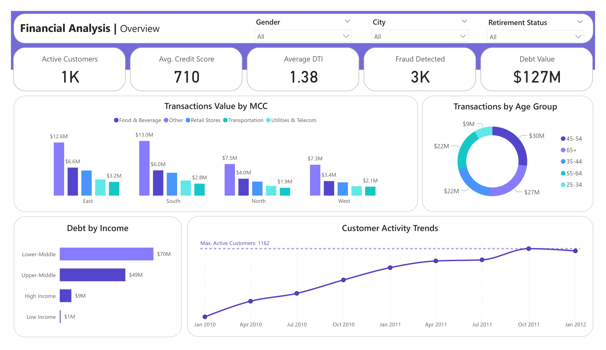
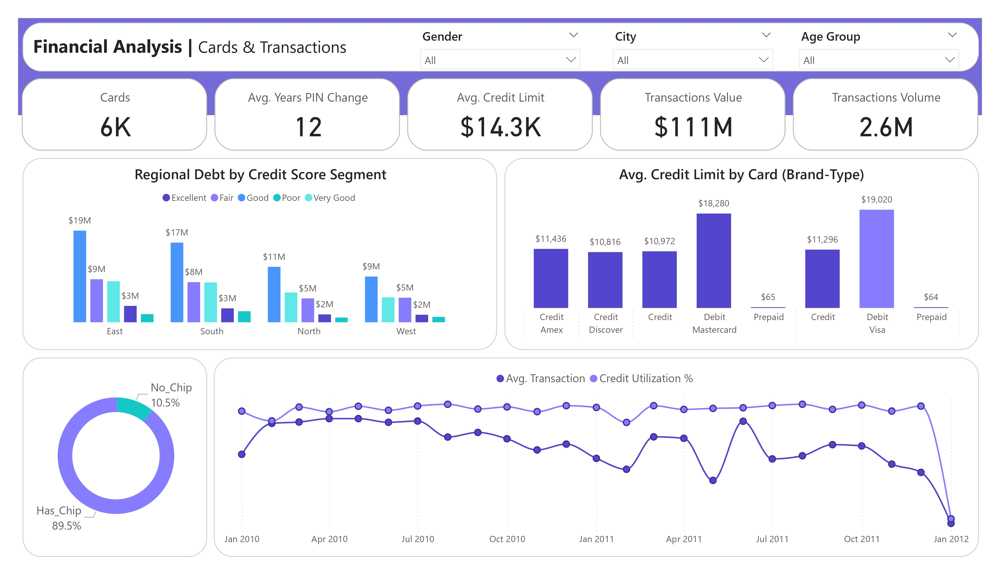
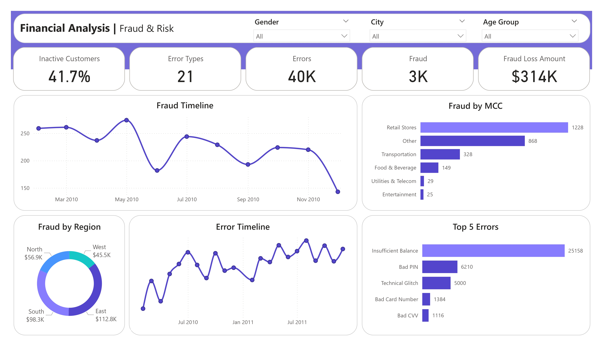

# 💳 Banking Analytics Dashboard

This project analyzes customer activity, credit usage, fraud risk, and operations using a synthetic banking dataset. It combines SQL Server, Python, and Power BI to give clear, actionable insights.

---

## 📌 Highlights

- Unified transactions, cards, fraud, and customer data in SQL Server.
- Cleaned and analyzed data in Python (Pandas, Matplotlib, Seaborn).
- Built Power BI dashboards for customer activity, credit, fraud, and KPIs.
- Segmented customers by age, income, credit score, and region.
- Identified fraud hotspots and operational error trends.

---

## 🗂️ Data

- **Source:** [kaggle](https://www.kaggle.com/datasets/computingvictor/transactions-fraud-datasets)
- **Transactions:** Amounts, timestamps, merchant details.
- **Cards:** Credit/debit limits, activation dates.
- **Fraud Labels:** Fraud vs. legitimate transactions.
- **Customers:** Demographics, income, account data.

---

## 🛠️ Tools

- **SQL Server:** Data storage & integration  
- **Python:** Cleaning & analysis  
- **Power BI:** Dashboards & DAX measures  
- **Jupyter Notebook:** – Data exploration  

---

## 📊 Key Insights

- Most spending from ages 45–54 and 65+.  
- Middle-income groups hold the highest total debt.  
- Fraud at 0.3% of transactions, mainly retail stores & East region.  
- Operational errors rising slightly, opportunity to improve processes.  
- East & South regions dominate debt and transaction values.  

---

## 📸 Dashboard

---

## 🚀 How to Use

1. Clone this repo.  
2. Load SQL scripts or CSVs into SQL Server.  
3. Run Python notebooks for cleaning/analysis.  
4. Open Power BI `.pbix` file to view dashboards [Power Bi Dashboard](https://drive.google.com/drive/folders/1A_yIfgO-U_TImPz6Yh6JLAHMTWI9PuX9?usp=sharing).  

---

## 💡 Business Value

- Target inactive customers to grow active base.  
- Strengthen fraud controls where losses are highest.  
- Improve processes to cut operational errors.  
- Adjust credit policies to balance risk and profitability.  

---

## 📬 Contact

Feedback or collaboration welcome!  
Connect on [LinkedIn](https://www.linkedin.com/in/reham-mahmoud-rushdi/).

